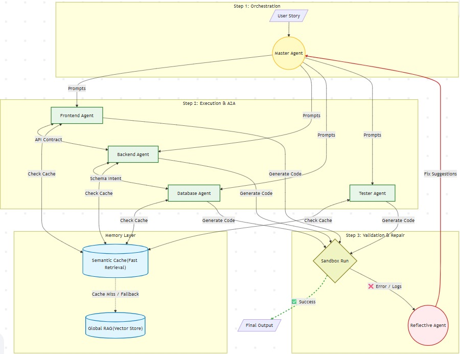

# AutoV2 - Multi-Agent AI Code Generation System

A sophisticated **multi-agent AI system** that automatically generates, deploys, and iterates on full-stack applications using LangGraph, Docker, React, FastAPI, PostgreSQL and LLMs.

## 🎯 Overview

AutoV2 is an intelligent code generation platform that:
- **Accepts natural language requirements** (user stories)
- **Generates complete API specifications** using an Architect Agent
- **Creates full-stack codebases** with 4 parallel agents (Frontend, Backend, Docker, Tests)
- **Automatically deploys** generated code in Docker containers
- **Executes and monitors** the application in a sandbox environment
- **Analyzes logs** using a Reflector Agent to identify errors
- **Iterates automatically** (up to 3 attempts) to fix issues
- **Provides human feedback loops** for final refinements via Streamlit UI

## 🏗️ Architecture

### Multi-Agent Workflow

```
User Story (Streamlit Input)
    ↓
[Architect Agent] → Generates API Specification
    ↓
[4 Parallel Agents]:
  ├─ Frontend Agent (React/Vite)
  ├─ Backend Agent (FastAPI)
  ├─ Docker Agent (Docker Compose)
  └─ Tests Agent (Pytest)
    ↓
[Sandbox Execution Node] → Writes files, runs Docker
    ↓
[Human Review Node] → Display logs, get user feedback
    ↓
[Reflector Agent] → Analyzes logs for errors
    ↓
[Router] → Routes errors to appropriate agents for iteration
    ↓
[Loop back or Complete] (max 3 iterations)
```

### Key Components

| Component | Purpose | Technology |
|-----------|---------|-----------|
| **Architect Agent** | Generates API specifications | LLM (Claude/GPT) |
| **Frontend Agent** | Creates React/Vite UI | LLM + Node.js |
| **Backend Agent** | Creates FastAPI REST API | LLM + Python |
| **Docker Agent** | Generates Docker Compose config | LLM + Docker |
| **Tests Agent** | Creates test suite | LLM + Pytest |
| **Sandbox Executor** | Runs Docker containers | Docker + Python |
| **Reflector Agent** | Analyzes container logs | LLM |
| **Router Agent** | Routes errors to agents | LLM + LangGraph |
| **Human Review Node** | Displays results & feedback | Streamlit UI |
| **State Machine** | Manages workflow state | LangGraph |

## 📋 Features

✅ **Fully Automated Code Generation** - From user story to running containers  
✅ **Parallel Agent Execution** - Frontend, Backend, Docker, Tests run simultaneously  
✅ **Sandbox Execution** - Isolated Docker environment for testing generated code  
✅ **Automatic Error Detection** - LLM analyzes logs for issues  
✅ **Iterative Improvement** - Automatically fixes errors up to 3 times  
✅ **Human Feedback Loop** - Users can review and provide input  
✅ **Interactive UI** - Streamlit interface for easy interaction  
✅ **Full-Stack Support** - React frontend + FastAPI backend + PostgreSQL DB  
✅ **Docker Integration** - Automatic containerization and orchestration  
✅ **Comprehensive Logging** - JSON logs from all containers for analysis  

## 🚀 Quick Start

### Prerequisites

- Python 3.11+
- Node.js 16+
- Docker & Docker Compose
- Git

### Installation

1. **Clone the repository**
```bash
git clone https://github.com/rohitk285/autodev_spider.git
cd AutoV2/code_gen_agent
```

2. **Create virtual environment**
```bash
python -m venv venv
source venv/Scripts/activate  # Windows: venv\Scripts\activate
```

3. **Install dependencies**
```bash
pip install -r requirements.txt
cd frontend
npm install
cd backend
npm install
```

4. **Set up environment variables**
```bash
# Create .env file in code_gen_agent/
GEMINI_API_KEY=your_api_key_here
LANGCHAIN_API_KEY=your_api_key_here  # Optional: for debugging
AZURE_API_KEY=your_api_key_here
```

5. **Run the application**
```bash
streamlit run streamlit_app.py
npm run dev
uvicorn main:app --reload
```

The application will open at `http://localhost:5173`

## Workflow diagram


## 💡 Usage

### Step 1: Enter Your Requirements
In the Streamlit app, enter a user story describing what you want to build:

**Example:**
```
Build a simple To-Do List app with a REST API backend and React frontend.
The app should allow users to:
- Create, read, update, and delete tasks
- Mark tasks as complete
- View all tasks
- Filter tasks by completion status
```

### Step 2: Generate Code
Click "Generate Code" and the system will:
1. Generate API specification
2. Create Frontend code (React/Vite)
3. Create Backend code (FastAPI)
4. Create Docker configuration
5. Create test suite

### Step 3: Review Generated Code
View the generated code in tabs:
- **Frontend Tab** - React components, API client, styling
- **Backend Tab** - FastAPI routes, database models, schemas
- **Docker Tab** - Docker Compose, environment config
- **Tests Tab** - Pytest test cases

### Step 4: Execute in Sandbox
The system automatically:
1. Writes all files to `docker/project/` directory
2. Runs `npm install` for dependencies
3. Builds Docker images
4. Starts containers (database, backend, frontend)
5. Collects logs from all services

### Step 5: Review Results
View execution results:
- **Status** - Success or error indication
- **Frontend URL** - Direct link to running app (usually `http://localhost:5173`)
- **Container Logs** - Detailed output from each service

### Step 6: Iterate (if needed)
If there are errors:
1. Select feedback type: "Success", "Error", "Modify", or "Skip"
2. The Reflector Agent analyzes logs
3. Appropriate agents are triggered to fix issues
4. System iterates (max 3 attempts)
5. Results are re-deployed

## 📁 Project Structure of Agentic Components

```
AutoV2/
├── code_gen_agent/              # Main application
│   ├── streamlit_app.py         # Streamlit frontend
│   ├── requirements.txt         # Python dependencies
│   ├── src/
│   │   ├── main.py             # Entry point
│   │   ├── core/
│   │   │   ├── state.py        # GraphState definition
│   │   │   ├── graph.py        # LangGraph workflow
│   │   │   └── __init__.py
│   │   ├── agents/
│   │   │   ├── architect.py    # API spec generation
│   │   │   ├── frontend.py     # React/Vite generation
│   │   │   ├── backend.py      # FastAPI generation
│   │   │   ├── docker_agent.py # Docker config generation
│   │   │   ├── tests_agent.py  # Test generation
│   │   │   ├── sandbox_execution.py  # Sandbox orchestration
│   │   │   ├── human.py        # Human review node
│   │   │   ├── reflector.py    # Log analysis
│   │   │   ├── router.py       # Error routing
│   │   │   └── __init__.py
│   │   ├── prompts/
│   │   │   ├── system_prompts.py     # All agent prompts
│   │   │   ├── fix_templates.py      # Error recovery templates
│   │   │   └── __init__.py
│   │   └── utils/
│   │       ├── llm_helper.py   # LLM wrapper functions
│   │       ├── code_exporter.py # File export utilities
│   │       ├── io_utils.py     # Input/output helpers
│   │       └── __init__.py
│   └── tests/
│       ├── test_graph.py       # Workflow tests
│       └── __init__.py
│
├── docker/                      # Sandbox execution environment
│   ├── sandbox.py              # Sandbox runner (writes, builds, deploys)
│   ├── backend.json            # Reference backend config
│   ├── frontend.json           # Reference frontend config
│   ├── docker.json             # Reference docker config
│   ├── tests.json              # Reference tests config
│   ├── project/                # Generated project structure
│   │   ├── docker-compose.yml
│   │   ├── backend/            # FastAPI app
│   │   ├── frontend/           # React app
│   │   ├── tests/              # Test suite
│   │   └── docker_logs/        # Execution logs
│   └── __pycache__/
│
└── README.md                    # This file
```

## 🔧 Configuration

### LLM Configuration

Edit `streamlit_app.py` to change the LLM provider:

```python
# Default: OpenAI GPT-4
llm = ChatOpenAI(model="gpt-4", temperature=0.7)

# Alternative: Anthropic Claude
# from langchain_anthropic import ChatAnthropic
# llm = ChatAnthropic(model="claude-3-sonnet-20240229")
```

### Agent Configuration

Modify system prompts in `src/prompts/system_prompts.py`:
- `ARCHITECT_PROMPT` - Controls API design approach
- `FRONTEND_PROMPT` - Controls React/UI generation
- `BACKEND_PROMPT` - Controls FastAPI code generation
- `DOCKER_PROMPT` - Controls Docker configuration
- `TESTS_PROMPT` - Controls test generation
- `REFLECTOR_PROMPT` - Controls error analysis

### State Management

GraphState in `src/core/state.py` tracks:
```python
messages: List[BaseMessage]           # Chat history
user_story: str                       # User requirements
api_spec: str                         # Generated API spec
architecture_plan: str                # Architecture design
frontend_files: Dict[str, str]        # React component files
backend_files: Dict[str, str]         # FastAPI files
docker_files: Dict[str, str]          # Docker configs
tests_files: Dict[str, str]           # Test files
sandbox_logs: Dict                    # Execution logs from containers
human_feedback: str                   # User feedback
iteration_count: int                  # Iteration tracker (max 3)
```

## 🐛 Troubleshooting

### Issue: "Port 8501 already in use"
```bash
streamlit run streamlit_app.py --server.port 8502
```

### Issue: "OPENAI_API_KEY not found"
Make sure your `.env` file exists in `code_gen_agent/` with:
```
GEMINI_API_KEY=sk-...your_key...
```

### Issue: "Docker build fails"
Check Docker is running:
```bash
docker ps
```

View full logs:
```bash
cd docker/project
docker-compose logs
```

### Issue: "Frontend can't connect to backend"
Verify backend is running:
```bash
docker-compose ps
docker-compose logs backend
```

Check backend health:
```bash
curl http://localhost:8000/docs
```

## 📊 Output Format

### Generated Code (JSON Format)

All agents output flat JSON with file paths as keys:

```json
{
  "src/main.jsx": "import React from 'react';\n...",
  "package.json": "{\n  \"name\": \"app\",\n  ...",
  "vite.config.js": "import { defineConfig } from 'vite';\n...",
  "..."
}
```

### Sandbox Results (JSON Format)

```json
{
  "status": "success",
  "frontend_url": "http://localhost:5173",
  "container_logs": {
    "db": "PostgreSQL running on port 5432",
    "backend": "Uvicorn running on 0.0.0.0:8000",
    "frontend": "Vite dev server running"
  },
  "timestamp": "2025-12-13T10:30:00Z"
}
```

## 🔄 Iteration Loop

The system automatically iterates when errors are detected:

1. **Iteration 1**: Initial generation
   - All 4 agents create code
   - Sandbox deploys
   - Reflector checks logs

2. **Iteration 2**: Fix detected errors
   - Agents targeting specific issues
   - Redeploy and verify
   - Check again

3. **Iteration 3**: Final refinement
   - Last attempt to fix issues
   - Human review required

4. **Success or Manual Intervention**
   - Either app works or user provides manual feedback

## 📈 Performance

- **Code Generation**: ~30-60 seconds (depends on LLM)
- **Docker Build**: ~1-2 minutes (first run), ~30 seconds (cached)
- **Total Time to Running App**: ~2-3 minutes
- **Iteration Time**: ~1-2 minutes per iteration

## 🛠️ Development

### Running Tests
```bash
pytest tests/
```

### Debugging
Enable LangSmith tracing:
```python
import os
os.environ["LANGCHAIN_TRACING_V2"] = "true"
os.environ["LANGCHAIN_API_KEY"] = "your_key"
```

### Adding Custom Agents

1. Create new agent file in `src/agents/`
2. Define agent function with `@agent` decorator
3. Add to graph in `src/core/graph.py`
4. Update routing in `router.py`

## 📝 Examples

### Example 1: Simple CRUD App
```
Build a Notes app with a REST API backend.
Users should be able to create, read, update, and delete notes.
Include timestamps for when notes were created and last modified.
```

### Example 2: E-commerce Platform
```
Create a simple e-commerce platform with:
- Product catalog
- Shopping cart functionality
- Order management
- User authentication
- Admin dashboard for inventory management
```

### Example 3: Chat Application
```
Build a real-time chat application with:
- User registration and login
- Chat rooms
- Message history
- User profiles
- Online status indicator
```

## 🤝 Contributing

Contributions are welcome! Please:

1. Fork the repository
2. Create a feature branch (`git checkout -b feature/amazing-feature`)
3. Commit changes (`git commit -m 'Add amazing feature'`)
4. Push to branch (`git push origin feature/amazing-feature`)
5. Open a Pull Request

## 📄 License

This project is licensed under the MIT License - see LICENSE file for details.

## 🙋 Support

For issues, questions, or suggestions:
- Open an issue on GitHub
- Check existing issues for solutions
- Review troubleshooting section above

## 🔐 Security Notes

- Never commit `.env` files with real API keys
- Use environment variables for sensitive data
- Keep Docker images updated
- Review generated code before running in production
- The sandbox isolates generated code execution